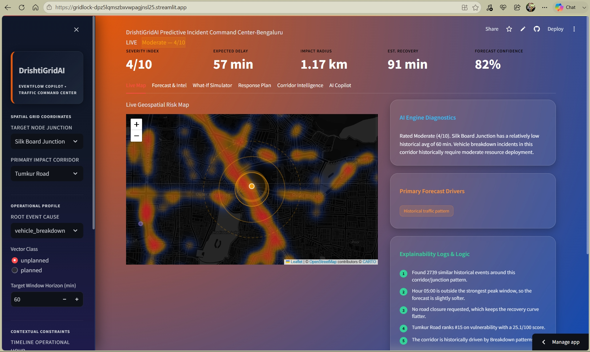
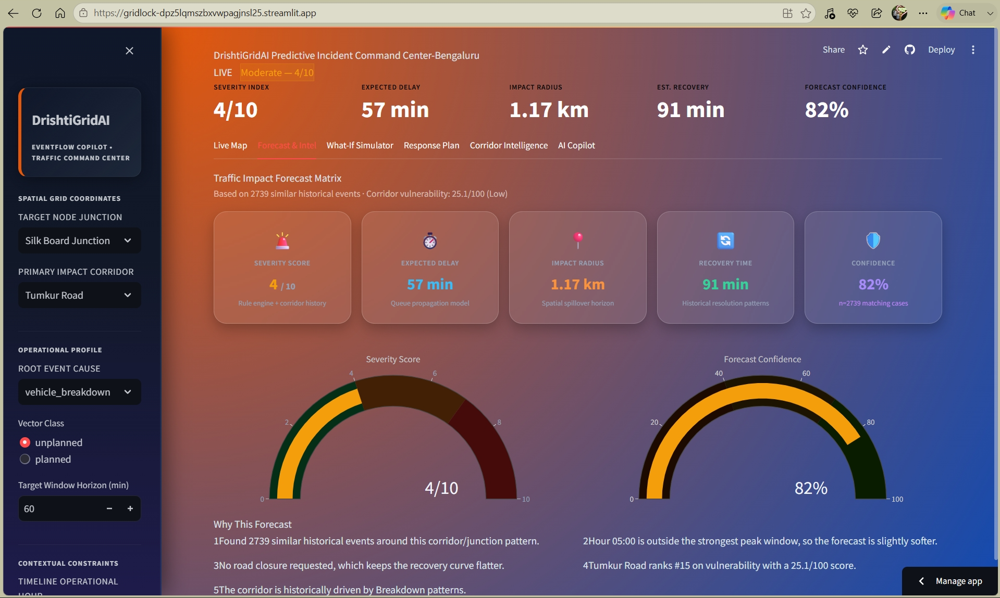
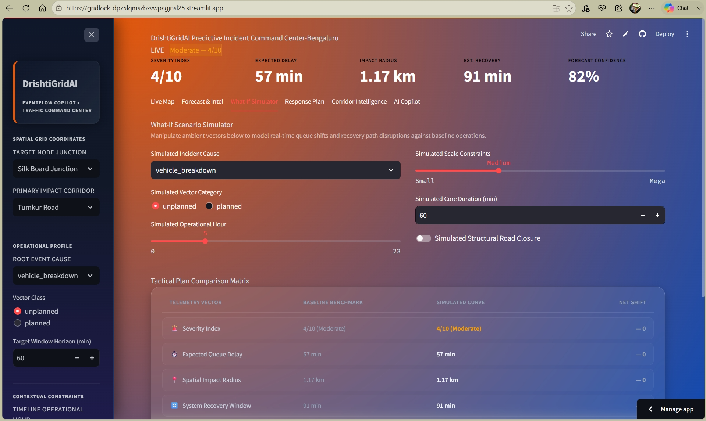
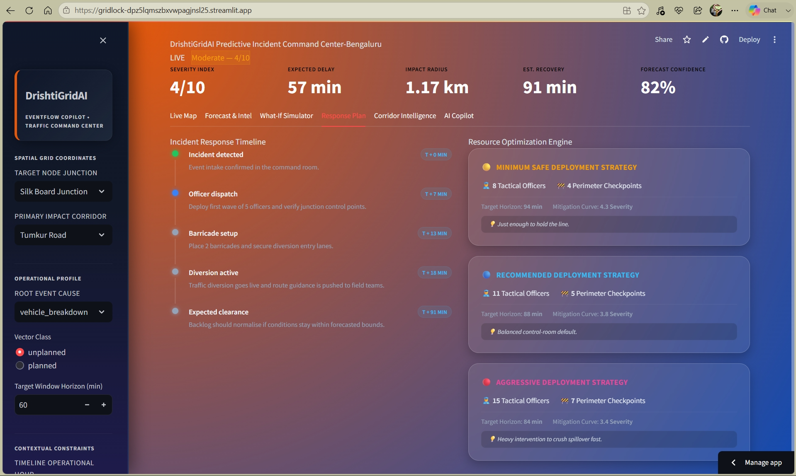
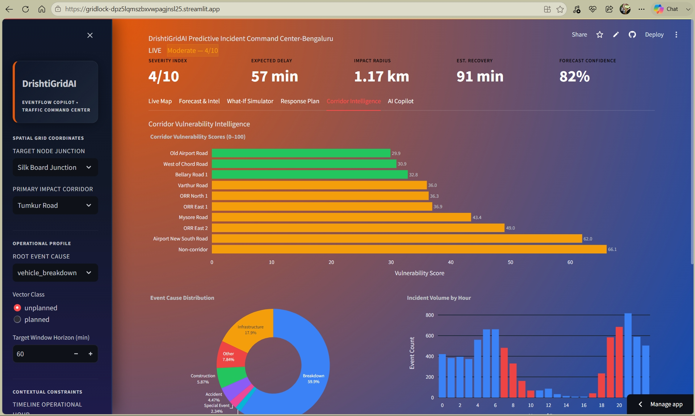
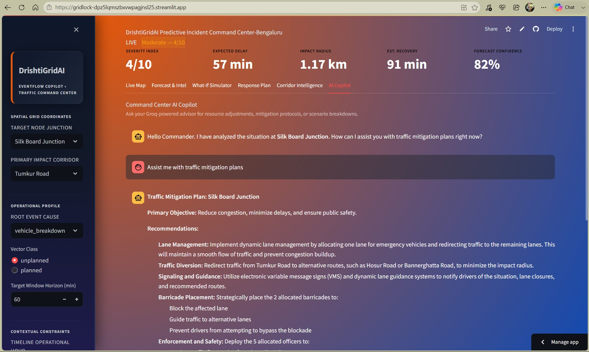

<div align="center">

# DrishtiGrid AI
### EventFlow Copilot

**A predictive command-center for event-driven traffic — forecasting congestion impact and recommending manpower, barricading, and diversion plans before any congestion even starts.**

<br/>


<br/>


<br/><br/>

**[Live Demo](https://gridlock-dpz5lqmszbxvwpagjnsl25.streamlit.app/)** · **[Source](https://gridlock-dpz5lqmszbxvwpagjnsl25.streamlit.app/)** 

</div>

<br/>

<div align="center">


</div>

---

##  Table of Contents

- [Overview](#-overview)
- [The Problem](#-the-problem)
- [What DrishtiGrid AI Does](#-what-drishtigrid-ai-does)
- [Feature Walkthrough](#-feature-walkthrough)
- [Screenshots](#-screenshots)
- [Dataset](#-dataset)
- [System Architecture](#-system-architecture)
- [Tech Stack](#-tech-stack)
- [Project Structure](#-project-structure)
- [Getting Started](#-getting-started)
- [Configuration](#-configuration)
- [Design Philosophy](#-design-philosophy)
- [Roadmap](#-roadmap)
- [Acknowledgements](#-acknowledgements)
- [License](#-license)

---

##  Overview

**DrishtiGrid AI** is a live, deployed traffic command-center for Bengaluru that turns historical incident data into real-time operational intelligence. An operator enters a single incident — junction, cause, time, crowd scale — and Gridlock instantly returns a full forecast: severity, expected delay, impact radius, recovery time, and a confidence score, paired with a complete response plan.

It is built to feel like software a real control room would use — not a notebook exported to a dashboard.

> **Answers DrishtiGrid AI gives an operator in seconds:**
> How risky is this event? · Which corridor is most vulnerable right now? · How many officers and barricades do I need? · What happens if the crowd doubles? · *Why* is the system recommending this?

---

##  The Problem

Bengaluru sees **900+ unplanned traffic events a month** — processions, VIP movement, vehicle breakdowns, waterlogging, protests, construction. Today, response is almost entirely reactive:

| Pain Point | Today | With Gridlock |
|---|---|---|
| Forecasting impact | Based on operator experience | Computed from 8,173 historical events |
| Resource deployment | Improvised on radio calls | Three-tier optimization (Minimum / Recommended / Aggressive) |
| Scenario planning | No structured way to test "what if" | Live What-If Simulator with instant comparison |
| Explaining a decision | Not explained | Plain-language reasoning grounded in real stats |
| Diversion planning | Improvised on the ground | Pre-mapped corridor-specific routes with barricade points |

---

##  What DrishtiGrid AI Does

<table>
<tr>
<td width="50%" valign="top">

###  Forecasts impact
Severity score, expected delay, affected radius, estimated recovery time, and a confidence score — all computed live from operator input cross-referenced against real historical data.

</td>
<td width="50%" valign="top">

###  Ranks corridor risk
Every corridor scored on incident frequency, average resolution time, road-closure rate, and peak-hour exposure — surfaced as a ranked vulnerability table.

</td>
</tr>
<tr>
<td width="50%" valign="top">

###  Simulates scenarios
Change crowd scale, duration, road closure, event type, or hour of day and instantly see how severity, delay, and manpower needs shift — *before* deploying anyone.

</td>
<td width="50%" valign="top">

###  Explains itself
Every score ships with a plain-language reason — peak-hour effects, corridor history, cause-specific patterns — so recommendations are operational, not a black box.

</td>
</tr>
<tr>
<td width="50%" valign="top">

###  Plans the response
A minute-by-minute incident timeline — detection → dispatch → barricade setup → diversion → clearance — generated for every incident.

</td>
<td width="50%" valign="top">

###  Talks back
A Groq-powered AI Traffic Commander answers operational questions in plain English, grounded entirely in the live forecast — not generic chat.

</td>
</tr>
</table>

---

##  Feature Walkthrough

<details open>
<summary><b> Live Map</b> — spatial risk intelligence</summary>
<br/>

- Historical incident density rendered as a live heatmap
- KMeans-clustered hotspots highlighting chronic risk zones
- Submitted incident shown with severity-coded pulse ring + impact radius
- Diversion route drawn as a polyline with barricade markers

</details>

<details>
<summary><b> Forecast & Intel</b> — five-metric impact forecast</summary>
<br/>

| Metric | Computed From |
|---|---|
| Severity Score (0–10) | Rule engine + corridor history |
| Expected Delay (min) | Queue propagation model |
| Affected Radius (km) | Spatial spillover horizon |
| Recovery Time (min) | Historical resolution patterns |
| Confidence (%) | Count of similar historical events |

Includes a full **explainability panel** — every forecast ships with the specific historical facts that produced it.

</details>

<details>
<summary><b> What-If Simulator</b> — scenario comparison engine</summary>
<br/>

Adjust crowd scale, event duration, road closure, event type/cause, and hour of day. DrishtiGrid AI recomputes the full forecast live and shows a side-by-side table:

```
Metric            Current Plan   Simulated Scenario   Change
Severity          6 / 10         9 / 10                ▲ +3
Delay              62 min        118 min               ▲ +56
Impact Radius      1.4 km        2.6 km                ▲ +1.2
Recovery Time      85 min        146 min                ▲ +61
Officers Needed    9             22                     ▲ +13
```

</details>

<details>
<summary><b> Response Plan</b> — timeline + resource optimization</summary>
<br/>

**Incident Timeline** — Detected → Dispatch → Barricade Setup → Diversion Active → Expected Clearance, with minute-level estimates.

**Three resourcing tiers**, computed per incident:

| Plan | Officers | Barricades | Use Case |
|---|---|---|---|
| 🟡 Minimum Safe | Lowest viable | Lowest viable | Hold the line |
| 🔵 Recommended | Balanced | Balanced | Default control-room choice |
| 🔴 Aggressive | Highest | Highest | Fastest possible clearance |

</details>

<details>
<summary><b> Corridor Intelligence</b> — city-wide vulnerability ranking</summary>
<br/>

- Full ranked table of every corridor by vulnerability score (0–100)
- Computed from incident frequency, avg. resolution time, closure rate, and peak-hour rate
- Visualized as a horizontal bar chart + event-cause donut + hourly volume chart

</details>

<details>
<summary><b> AI Traffic Commander</b> — conversational layer (Groq)</summary>
<br/>

A chat interface grounded in the **live** incident context — not a generic assistant. Ask things like:

- *"Why is this corridor high risk?"*
- *"What happens if crowd increases by 30%?"*
- *"How many officers should I deploy and where?"*
- *"Which corridor is most vulnerable right now?"*

The system prompt injects the current forecast, resource plan, and corridor stats on every turn, so answers are numerically grounded, not hallucinated.

</details>

---

##  Screenshots

<p align="center">
  
  <br/><sub><b>Live Map</b> — historical heatmap, KMeans hotspots, and active incident overlay</sub>
</p>

<br/>

<p align="center">
  
  <br/><sub><b>Forecast & Intel</b> — five-metric impact forecast with explainability</sub>
</p>

<br/>

<p align="center">
  
  <br/><sub><b>What-If Simulator</b> — live scenario comparison</sub>
</p>

<br/>

<p align="center">
  
  <br/><sub><b>Response Plan</b> — incident timeline and 3-tier resourcing</sub>
</p>

<br/>

<p align="center">
  
  <br/><sub><b>Corridor Intelligence</b> — city-wide vulnerability ranking</sub>
</p>

<br/>

<p align="center">
  
  <br/><sub><b>AI Commander</b> — Groq-powered operational Q&A</sub>
</p>

## Dataset

Built on a real Bengaluru traffic operations dataset.

<div align="center">

| | | |
|---|---|---|
| **8,173** rows | **46** columns | **9** event causes |

</div>

**Key fields used:** `start_datetime`, `end_datetime`, `latitude`, `longitude`, `corridor`, `junction`, `police_station`, `event_type`, `event_cause`, `status`, `priority`, `requires_road_closure`, `description`, `veh_type`, `reason_breakdown`, plus resolution fields like `closed_datetime` / `resolved_datetime`.

**What the data tells us:** most events are unplanned; dominant causes are vehicle breakdown, construction, waterlogging, accidents, tree falls, public events, processions, protests, and VIP movement. Several operational fields are sparse — the pipeline is built to be robust to missingness rather than assuming clean labels.

#### What's computed for real vs. what's simulated

|  Computed for real |  Deliberately simulated |
|---|---|
| Junction & corridor historical averages (`groupby` on real data) | Diversion route geometry (realistic Bengaluru waypoints) |
| KMeans clustering on lat/long for hotspot detection | Live real-time event feed (demo mode, no live sensors) |
| Corridor vulnerability scoring (frequency, closure rate, peak-hour rate) | Severity weighting via an explainable rule engine, not opaque ML |

This is an intentional choice — a transparent rule engine beats a black-box model trained on 8K sparse rows.

---

##  System Architecture

```
┌─────────────────────────────────────────────────────────────┐
│                        DATA LAYER                           │
│   8,173-row CSV → cleaning → feature engineering (pandas)   │
└──────────────────────────────┬────────────────────────────────┘
                                 ▼
┌─────────────────────────────────────────────────────────────┐
│                    INTELLIGENCE LAYER                       │
│  Rule engine · KMeans clustering · corridor vulnerability   │
│  scoring · forecast model · resource optimization           │
└──────────────────────────────┬────────────────────────────────┘
                                 ▼
┌─────────────────────────────────────────────────────────────┐
│                  CONVERSATIONAL LAYER                       │
│        Groq LLM API · context-grounded system prompt        │
└──────────────────────────────┬────────────────────────────────┘
                                 ▼
┌─────────────────────────────────────────────────────────────┐
│                   PRESENTATION LAYER                        │
│   Streamlit · Folium maps · Plotly charts · custom CSS      │
└─────────────────────────────────────────────────────────────┘
```

---

##  Tech Stack

<div align="center">

| Layer | Technology |
|---|---|
| **App framework** | [Streamlit](https://streamlit.io) `1.35.0` |
| **Data processing** | pandas, NumPy |
| **Maps** | Folium + `streamlit-folium`, HeatMap plugin |
| **Charts** | Plotly (gauges, bar, pie, indicator charts) |
| **ML** | scikit-learn (KMeans clustering) |
| **Conversational AI** | [Groq](https://groq.com) API (LLM inference) |
| **Styling** | Custom dark CSS theme (command-center aesthetic) |

</div>

---

##  Project Structure

```text
gridlock-eventflow-copilot/
├── app.py                     # Main Streamlit app — 6 tabs, all UI logic
├── requirements.txt           # Python dependencies
├── packages.txt                # System-level deps (zlib, libjpeg)
├── .devcontainer/
│   └── devcontainer.json       # Codespaces / dev container config
├── assets/
│   └── custom.css              # Command-center dark theme
├── utils/
│   ├── data_processor.py       # Cleaning, feature engineering, KPI stats
│   ├── models.py               # Forecast engine, vulnerability scoring,
│   │                           # resource optimization, explainability,
│   │__________________________ # diversion routes, timeline builder
│           
│                                
├── Astram event data_anonymized...csv   # 8,173-row Bengaluru dataset
└── README.md
```

---

##  Getting Started

### Prerequisites

- Python 3.10+
- A [Groq API key](https://console.groq.com/keys) (free tier available) for the AI Commander tab

### 1. Clone the repo

```bash
git clone https://github.com/darpan-NITS/Gridlock
cd gridlock-eventflow-copilot
```

### 2. Create and activate a virtual environment

```bash
python -m venv .venv

# macOS / Linux
source .venv/bin/activate

# Windows
.venv\Scripts\activate
```

### 3. Install dependencies

```bash
pip install -r requirements.txt
```

### 4. Set your Groq API key

```bash
# macOS / Linux
export GROQ_API_KEY="your-key-here"

# Windows (PowerShell)
$env:GROQ_API_KEY="your-key-here"
```

Or add it to Streamlit secrets at `.streamlit/secrets.toml`:

```toml
GROQ_API_KEY = "your-key-here"
```

### 5. Run the app

```bash
streamlit run app.py
```

The app opens at `http://localhost:8501`.

> **No CSV? No problem.** If the dataset file isn't found, Gridlock automatically falls back to a generated synthetic dataset with realistic Bengaluru junctions and corridors, so the demo never breaks.

---

##  Configuration

| Variable | Required | Description |
|---|---|---|
| `GROQ_API_KEY` | For AI Commander tab | Powers the conversational layer. App works without it — only that tab is disabled. |

Deployed via **Streamlit Community Cloud** — `packages.txt` and `.devcontainer/devcontainer.json` are included for GitHub Codespaces / cloud build compatibility.

---

##  Design Philosophy

> Built like a product. Not a notebook.

**What we prioritized**
- Fast demo load time and a stable, deploy-ready build
- Explainability over raw model accuracy
- Decision support (three-tier plans, live simulation) over static dashboards
- A real command-center visual language — dark theme, severity color-coding, live indicators

**What we deliberately avoided**
- Deep learning on a sparse 8K-row dataset (overfitting risk, zero explainability gain)
- Fake precision — every number traces back to either real data or a stated rule
- Decorative charts with no operational story
- Features that look impressive in a demo but wouldn't survive a real control room

---

##  Roadmap

<table>
<tr>
<th width="33%">🟡 Near-Term</th>
<th width="33%">🔵 Mid-Term</th>
<th width="33%">🟣 Long-Term</th>
</tr>
<tr valign="top">
<td>

- Live SMS / WhatsApp alerts to field officers on deployment
- Post-event accuracy tracker — forecast vs. actual outcome
- Downloadable PDF response brief for field teams

</td>
<td>

- Integration with live Bengaluru Traffic Police data feeds
- Real road-network routing (replacing hardcoded diversion paths)
- Multi-incident correlation — detect cascading congestion

</td>
<td>

- Learning loop: model recalibrates from post-event outcomes
- Multi-city expansion beyond Bengaluru
- Role-based access for control-room hierarchy

</td>
</tr>
</table>

---

##  Acknowledgements

- **Flipkart Gridlock Hackathon 2.0** for the problem statement
- The Bengaluru traffic operations team behind the source dataset
- The open-source Python ecosystem — Streamlit, pandas, scikit-learn, Folium, Plotly
- [Groq](https://groq.com) for fast, low-latency LLM inference powering the AI Commander

---

##  License

This project is submitted for hackathon demonstration purposes.

```
MIT License — feel free to fork, adapt, and build on this.
Add a LICENSE file with the full text if open-sourcing beyond the hackathon.
```

---

<div align="center">

**DrishtiGrid AI — EventFlow Copilot**
<br/>
*From reactive to ready.*

<br/>

Made with consistency for Bengaluru's traffic control rooms

</div>
